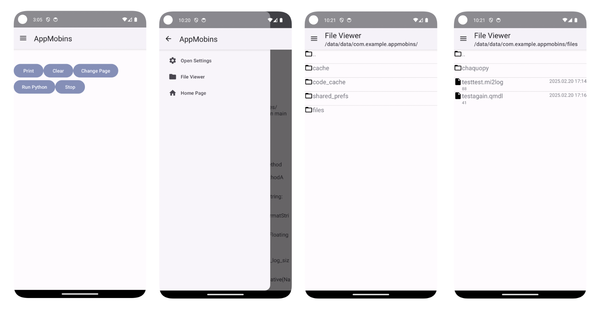
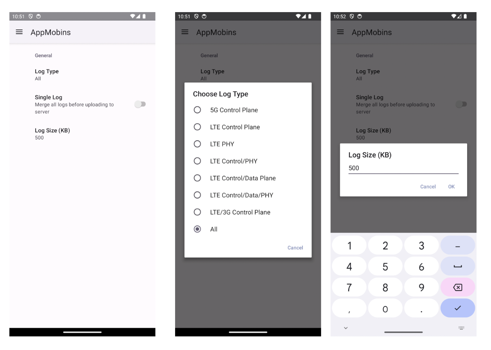

Frontend adaptation of [Mobile insight project](https://github.com/mobile-insight/mobileinsight-core/tree/ubuntu22-py310/)

AppMobins contains the newest working version using Groovy Gradle, Kotlin and XML Views.

Jetpack_consoleAttempt contains the older version written with Kotlin Gradle, Kotlin and Jetpack Compose.

Progress doc is [here](https://docs.google.com/document/d/10_bcqRQ_ZL_Vh2YslFhlJK5y0NOvC8v-/edit?usp=sharing&ouid=111669255057657587724&rtpof=true&sd=true)
